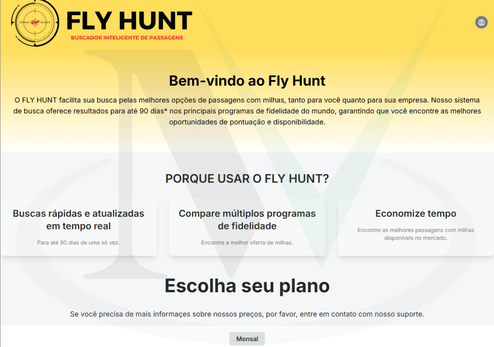
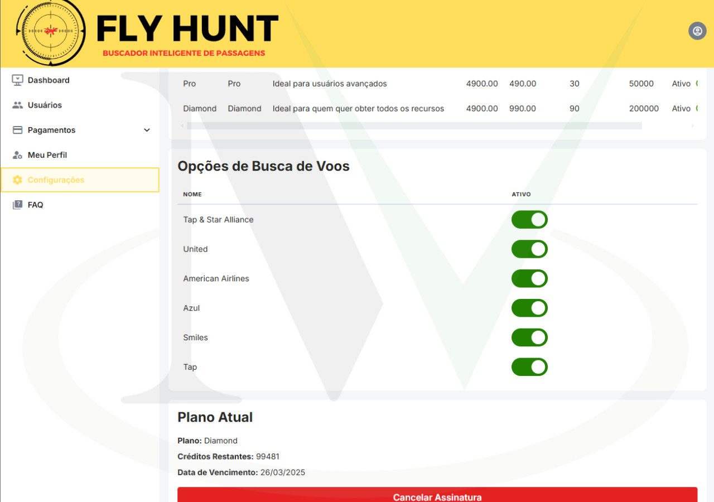
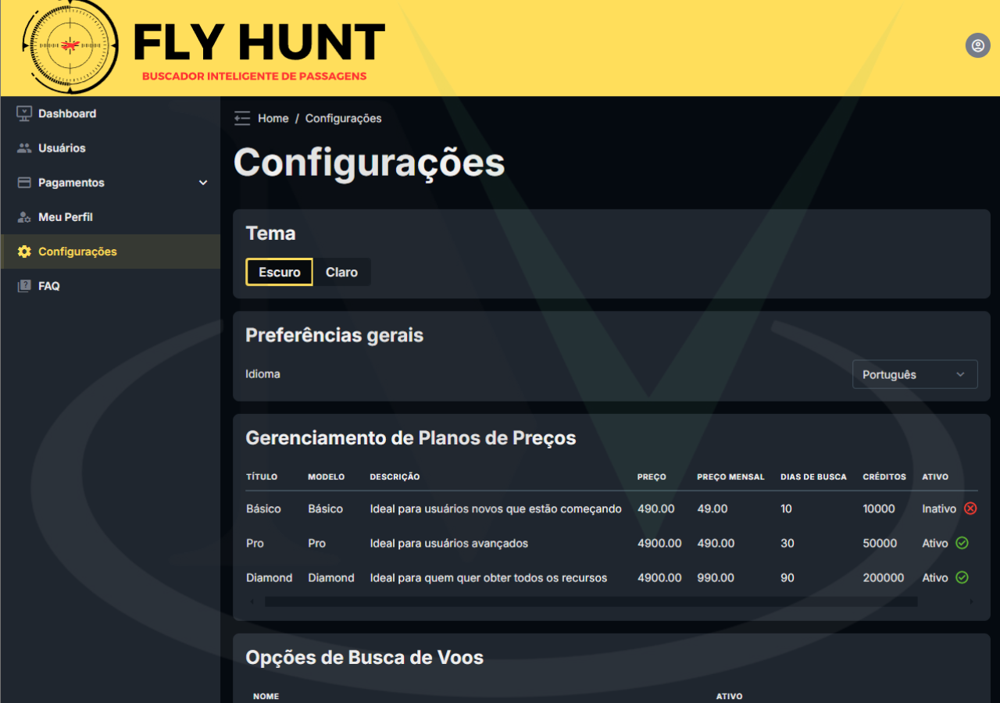
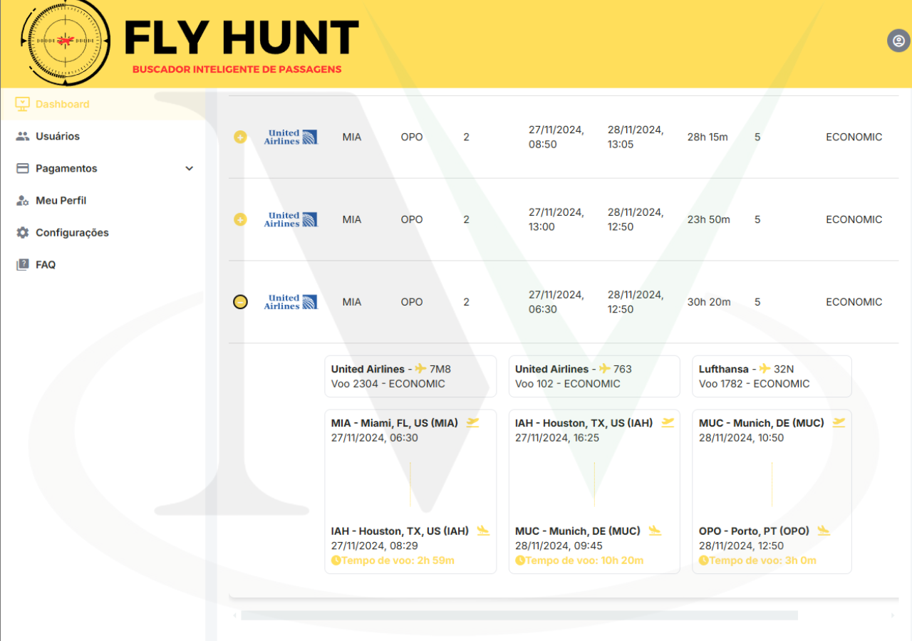

  <!-- Languages: -->
  <a title="Português" href="README_ptbr.md">🇧🇷 Português</a>

# Fly Hunt Milhas ✈️

**Fly Hunt Milhas** is an innovative platform that allows users to search for flights across various airlines using miles. With support for airlines such as Smiles, Azul, Iberia, American Airlines, United, and TAP, the platform makes it easier for travelers to optimize their miles usage.

---

## Features ✨

- **Flight Search** 🔍: Search for flights across multiple airlines using miles.
- **Airline Integration** 🔗: Connection with Smiles, Azul, Iberia, American Airlines, United, and TAP.
- **Real-Time Monitoring** ⏱️: Logs and monitoring of operations and services.

---

## Technologies Used 🛠️

### Backend
- **Python** 🐍: Main language for backend development.
- **Django** 🌐: Web framework for building APIs and data management.
- **Celery** 🥬: For asynchronous tasks and job scheduling.
- **PostgreSQL** 🗄️: Relational database for data storage.
- **Redis** 🔴: Used as a broker for Celery.
- **Nginx** 🌐: Web server to serve the application and static files.
- **Gunicorn** 🦄: WSGI server for Python applications.

### Frontend
- **Vue.js** 🖼️: Progressive JavaScript framework for building interactive user interfaces.
- **Vuex** 📦: Centralized state management for Vue.js applications.
- **Vue Router** 🧭: Routing for navigation between pages in Vue.js applications.

### DevOps
- **Ubuntu** 🐧: Operating system used for the production environment.
- **Docker** 🐳: Containerization to ensure consistency between development and production environments.
- **Google Cloud Platform (GCP)** ☁️: Cloud platform used to host the application.
- **GitHub Actions** ⚙️: Continuous integration and continuous delivery (CI/CD) for automating tests and deployments.

---

## Authors 👥

- **@miltonvo** 👨‍💻: Main developer and responsible for project maintenance.

---

## Demonstration 📺

|  |  |  |
|:------------------------:|:------------------------:|:------------------------:|
|  |  |  |

### Video Demonstration 🎥

🔗 **Clickable content below** ⬇️

