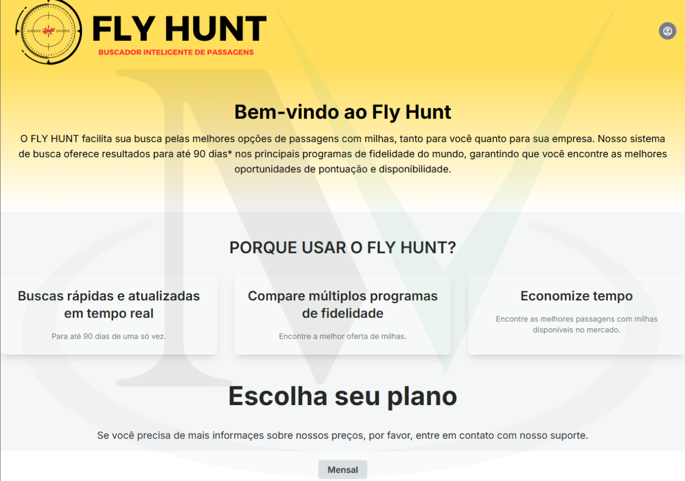
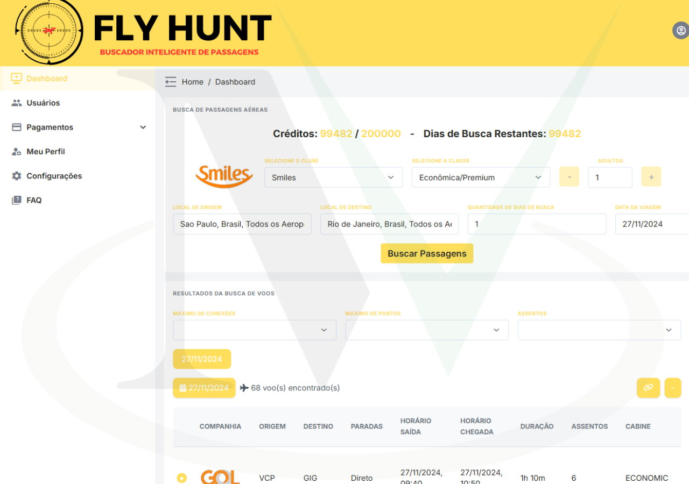
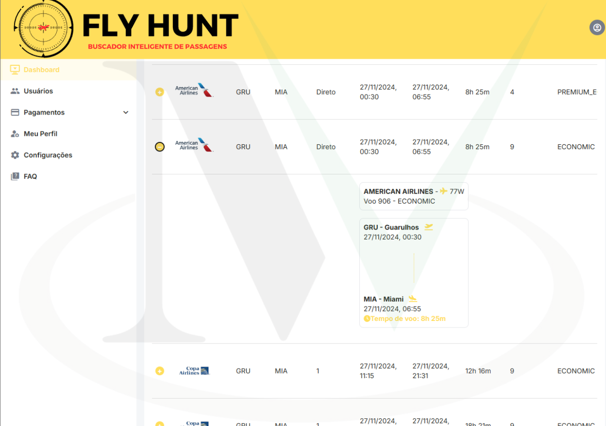
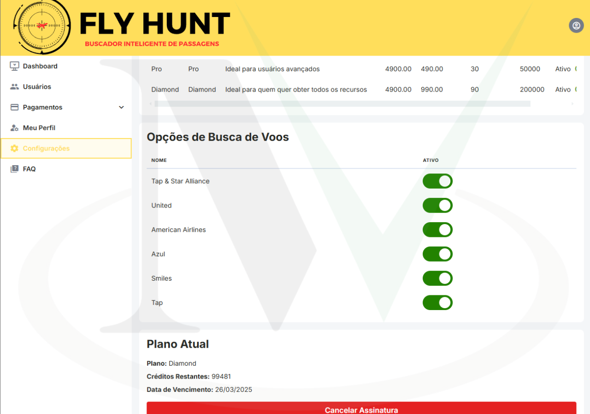
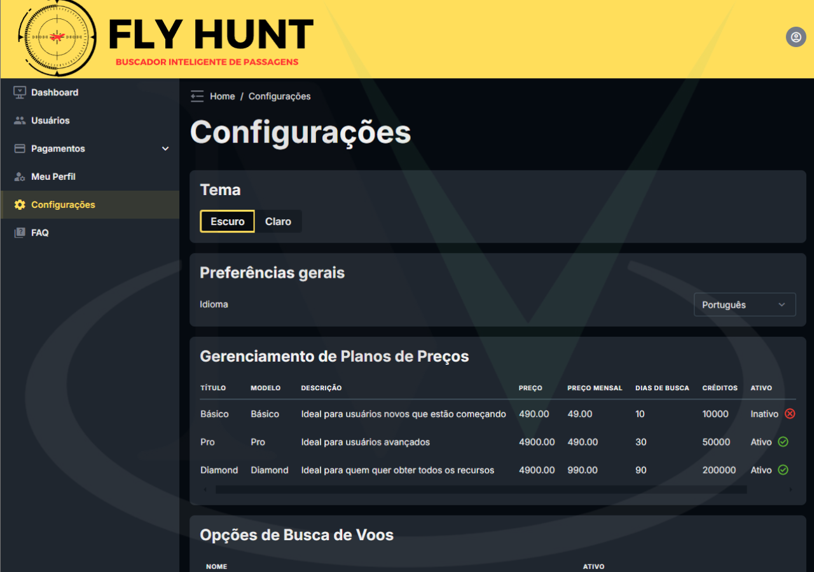
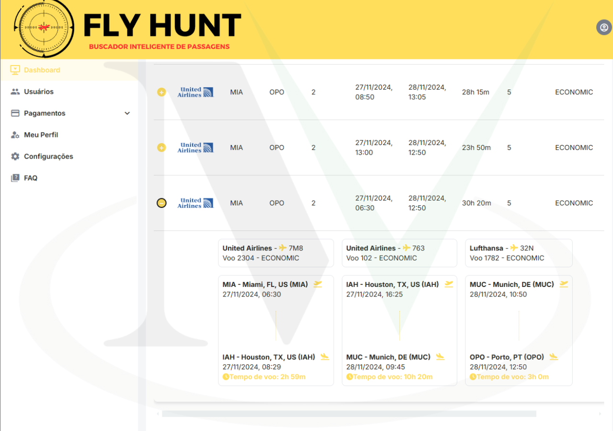

  <!-- Idiomas: -->
  <a title="English" href="README.md">🇺🇸 English</a>

# Fly Hunt Milhas ✈️

**Fly Hunt Milhas** é uma plataforma inovadora que permite aos usuários buscar voos em várias companhias aéreas utilizando milhas. Com suporte para companhias como Smiles, Azul, Iberia, American Airlines, United e TAP, a plataforma facilita a vida dos viajantes que desejam otimizar o uso de suas milhas.

---

## Funcionalidades ✨

- **Busca de Voos** 🔍: Pesquisa de voos em diversas companhias aéreas utilizando milhas.
- **Integração com Companhias** 🔗: Conexão com Smiles, Azul, Iberia, American Airlines, United e TAP.
- **Monitoramento em Tempo Real** ⏱️: Logs e monitoramento de operações e serviços.

---

## Tecnologias Utilizadas 🛠️

### Backend
- **Python** 🐍: Linguagem principal para desenvolvimento do backend.
- **Django** 🌐: Framework web para construção de APIs e gerenciamento de dados.
- **Celery** 🥬: Para tarefas assíncronas e agendamento de jobs.
- **PostgreSQL** 🗄️: Banco de dados relacional para armazenamento de dados.
- **Redis** 🔴: Usado como broker para o Celery.
- **Nginx** 🌐: Servidor web para servir a aplicação e arquivos estáticos.
- **Gunicorn** 🦄: Servidor WSGI para aplicações Python.

### Frontend
- **Vue.js** 🖼️: Framework JavaScript progressivo para construção de interfaces de usuário interativas.
- **Vuex** 📦: Gerenciamento de estado centralizado para aplicações Vue.js.
- **Vue Router** 🧭: Roteamento para navegação entre páginas em aplicações Vue.js.

### DevOps
- **Ubuntu** 🐧: Sistema operacional usado para o ambiente de produção.
- **Docker** 🐳: Containerização para garantir consistência entre ambientes de desenvolvimento e produção.
- **Google Cloud Platform (GCP)** ☁️: Plataforma de nuvem usada para hospedar a aplicação.
- **GitHub Actions** ⚙️: Integração contínua e entrega contínua (CI/CD) para automação de testes e deploys.

---

## Autores 👥

- **@miltonvo** 👨‍💻: Desenvolvedor principal e responsável pela manutenção do projeto.

---

## Demonstração 📺

|  |  |  |
|:------------------------:|:------------------------:|:------------------------:|
|  |  |  |

### Demonstração em Vídeo 🎥

🔗 **Conteúdo clicável abaixo** ⬇️

